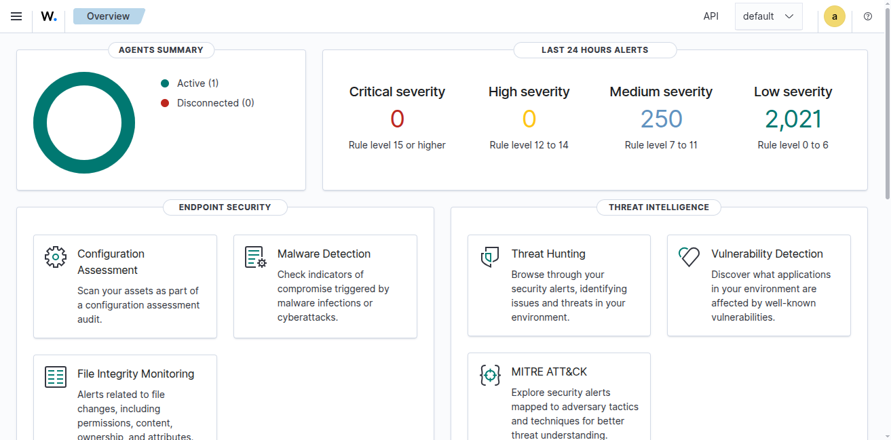
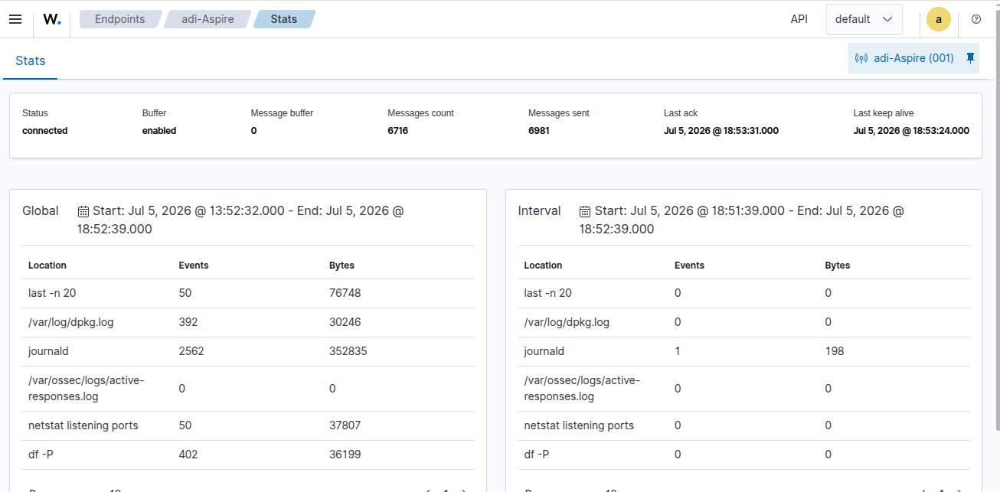
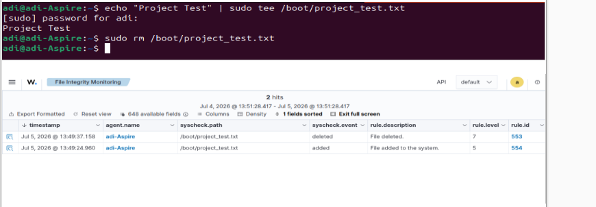
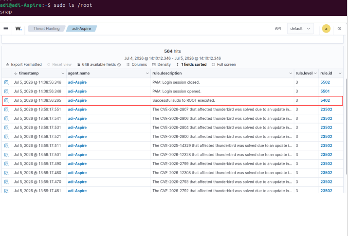
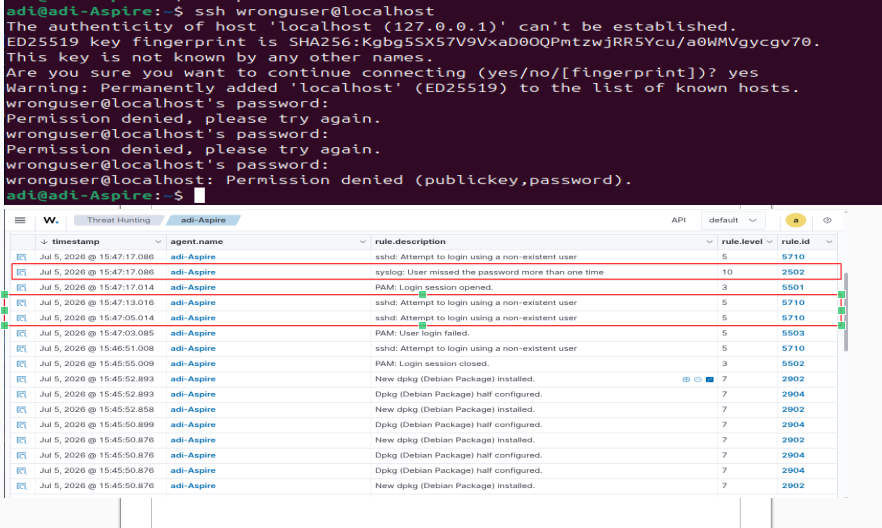
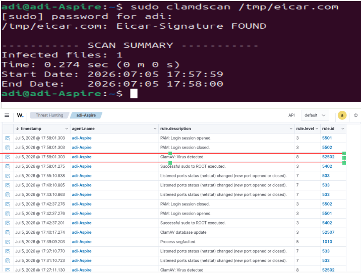

# Cloud-Based SIEM Lab using Wazuh for Linux Endpoint Monitoring


## 🚦 Project Status

**Status:** ✅ Completed

This project demonstrates the deployment of a cloud-hosted Wazuh SIEM environment on Microsoft Azure and the validation of common Linux security monitoring scenarios using an Ubuntu endpoint.

---

# 🏗 Architecture

<p align="center">

</p>

---


# 📖 Project Overview

This project demonstrates the deployment and validation of a cloud-based Security Information and Event Management (SIEM) platform using Wazuh on Microsoft Azure.

An Ubuntu Server virtual machine hosts the Wazuh Manager, Indexer, Dashboard and API, while an Ubuntu Desktop endpoint is monitored using the Wazuh Agent. Security events were intentionally generated, investigated and documented to validate common SOC monitoring workflows.

---

# 🎯 Problem Statement

Linux endpoints continuously generate security-relevant logs. Without centralized monitoring, suspicious activities such as privilege escalation, unauthorized file modifications and failed authentication attempts may go unnoticed.

This project demonstrates how a SIEM can centralize endpoint telemetry and provide actionable alerts for investigation.

---

# ⭐ Project Highlights

- Deployed Wazuh on Microsoft Azure.
- Connected an Ubuntu endpoint using the Wazuh Agent.
- Validated File Integrity Monitoring, sudo detection, SSH authentication, package monitoring, cron monitoring and malware detection.
- Investigated alerts through the Wazuh Dashboard.
- Built a reusable SOC home lab.

---

# 🛠 Technology Stack

| Component | Technology |
|-----------|------------|
| Cloud | Microsoft Azure |
| Server | Ubuntu Server 24.04 LTS |
| Endpoint | Ubuntu Desktop 24.04 LTS |
| SIEM | Wazuh |
| Dashboard | Wazuh Dashboard |
| Indexer | Wazuh Indexer |
| API | Wazuh API |
| Agent | Wazuh Agent |

---

# 🚀 Deployment Summary

The Wazuh platform was deployed on an Ubuntu Server VM hosted on Microsoft Azure. An Ubuntu Desktop endpoint was enrolled using the Wazuh Agent for centralized monitoring.

<p align="center">

</p>

---

# 📊 Detection Coverage

| Detection | Status |
|-----------|:------:|
| Agent Connectivity | ✅ |
| Heartbeat | ✅ |
| File Integrity Monitoring | ✅ |
| Privilege Escalation | ✅ |
| SSH Authentication | ✅ |
| Package Monitoring | ✅ |
| User Monitoring | ✅ |
| Cron Monitoring | ✅ |
| Endpoint Inventory | ✅ |
| Malware Detection (EICAR) | ✅ |

---

# ✅ Validation

<p align="center">

</p>

---

# 🔍 Detection Scenarios

## File Integrity Monitoring

Validated file creation and modification monitoring.

<p align="center">

</p>

**Result:** Successful detection.

## Privilege Escalation

Validated sudo monitoring.

<p align="center">

</p>

**Result:** Successful detection.

## Failed SSH Authentication

<p align="center">

</p>

**Result:** Failed SSH attempts detected.

## Malware Detection (EICAR)

<p align="center">

</p>

**Result:** EICAR test file detected successfully.

---

# 💡 Skills Demonstrated

- SIEM Deployment
- Linux Administration
- Microsoft Azure
- Endpoint Monitoring
- Log Analysis
- Security Event Investigation
- Incident Documentation

---

# 📁 Repository Structure

```text
Cloud-SIEM-Wazuh/
├── README.md
├── LICENSE
├── architecture/
├── screenshots/
├── docs/
└── reports/
```

---

# ⚠ Challenges Faced

- Troubleshooting File Integrity Monitoring.
- Re-enrolling the Wazuh Agent after recreating the VM.
- Resolving dashboard synchronization.
- Understanding component communication.

---

# 📚 Lessons Learned

- Wazuh architecture.
- Linux log monitoring.
- Security event validation.
- SOC investigation workflow.

---

# 🚀 Future Improvements

- Windows endpoints
- Active Response
- Suricata integration
- MITRE ATT&CK mapping
- Sigma rules
- Custom Wazuh rules

---

# 📖 References

- Wazuh Official Documentation
- Microsoft Azure Documentation
- Ubuntu Documentation
- MITRE ATT&CK Framework

⭐ If you found this project useful, consider giving it a star.
